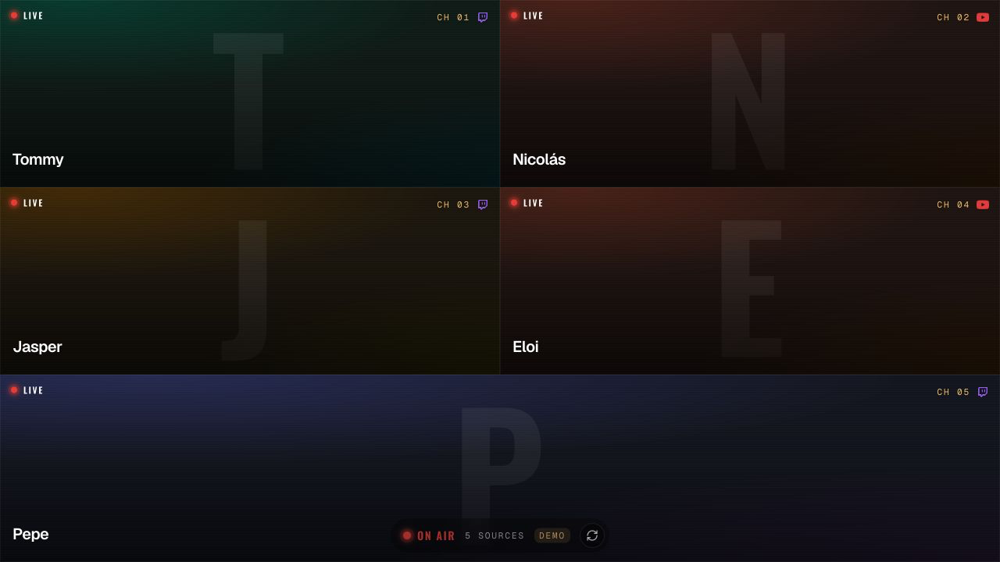
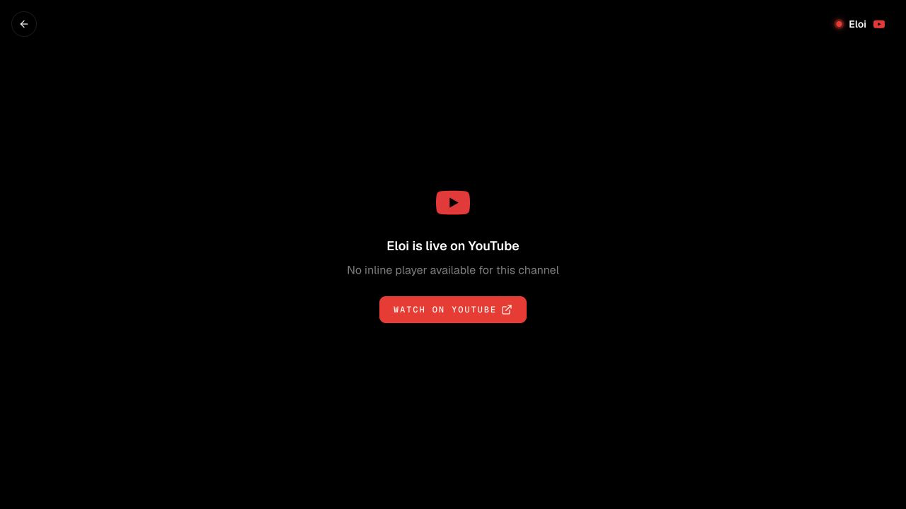
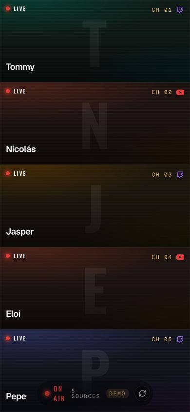

<div align="center">
  <h1>StreamGuard Site</h1>
  <p>A fullscreen live stream wall for servers using the StreamGuard Minecraft plugin.</p>

  [](https://github.com/lutzseverino/minecraft-stream-guard-site/actions/workflows/ci.yml)
  [](LICENSE)
</div>

StreamGuard Site is a companion web surface for
[StreamGuard](https://github.com/lutzseverino/minecraft-stream-guard), a
Paper/Spigot plugin that checks whether survival players are live on Twitch or
YouTube.

The site reads the plugin's live feed and turns the current streamers into a
fullscreen broadcast wall. Every live player becomes a screen; selecting a
screen opens the Twitch or YouTube embed.

## Screenshots

Captured from the local development demo feed.



| Focused stream | Mobile wall |
| --- | --- |
|  |  |

## Development

Install Node.js 24 and npm 11.6.2, then:

```bash
npm ci
npm run dev
```

Run the canonical local gate before opening a pull request:

```bash
npm run check
```

The gate runs Biome, typed ESLint, TypeScript, Vitest,
dependency-cruiser, and a production build.

## Plugin Feed

The site reads `/api/live`, served by the
[StreamGuard plugin](https://github.com/lutzseverino/minecraft-stream-guard). In local development,
`vite.config.ts` proxies that path to `http://127.0.0.1:8127`.

When the plugin is not running, development builds use a demo feed so the wall remains inspectable.
Production builds expect the real plugin feed.

## Documentation

Start with the [documentation index](docs/README.md). Documentation is organized
by reader intent so durable guidance has one predictable home.

## License

StreamGuard Site is available under the [GNU General Public License v3.0](LICENSE).
